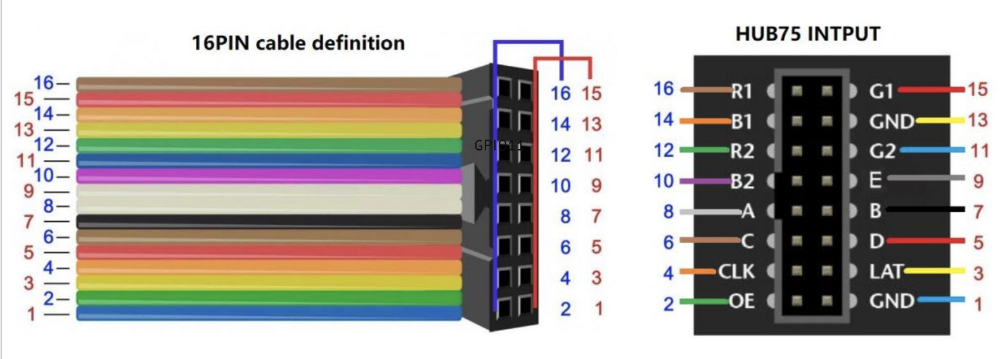

# transit-tracker
This is a personal transit tracker project for CTA buses and trains.

Status: Working on PCB layout

## Requirements

**Hardware**

2 64x32 LED matrices

ESP32-S3 DevKit C1 (soon just the PCB)

Power supply

Connector (right now need the special one for the matrix, soon just a USB-C)

## Installing/Building

(These instructions reflect the set-up process as of May 16, 2026. They are subject to change soon as I am designing a dedicated PCB for this project.)

### Getting API Keys

Before you start connecting or building anything, you need to have API keys for CTA trains and buses. You can get those here:

Buses: https://ctabustracker.com/account

Trains: https://www.transitchicago.com/developers/traintrackerapply/

Once you have your keys, pull this repo. Inside the `include` folder, make a `secrets.h` file and place your keys in there, like this:

```
#ifndef SECRETS_H
#define SECRETS_H

#define TRAIN_TRACKER_API_KEY "Your key here"
#define BUS_TRACKER_API_KEY "Your keky here"

#endif
```

Now you're ready to build

### Building the project

1. Connect LED matrices together with HUB75 cable

2. Flash ESP32

3. Connect LED matrix to ESP32 cable using HUB75 Cable. Write down what pin ESP32 pin connects to each HUB75 pin. To do that, this figure is helpful:

   

4. Run idf.py menuconfig on the ESP32
   1. Set the HUB75 pin configuration above
   2. Set your WiFi configuration
   3. Set your transit tracker configuration
5. Connect both the ESP32 and the LED matrices to power
   1. ESP32 just through computer
   2. Matrices through dedicated cable 
   3. (Soon both of them just through the PCB.)
6. Watch your trains/buses go!

### Libraries/Skills used

C, C++, ESP IDF/FreeRTOS, LVGL, PCB Design, CAD (Autodesk Fusion), 3D Printing

