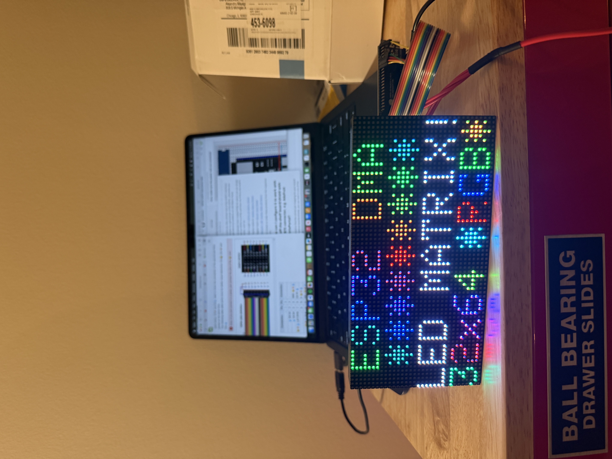
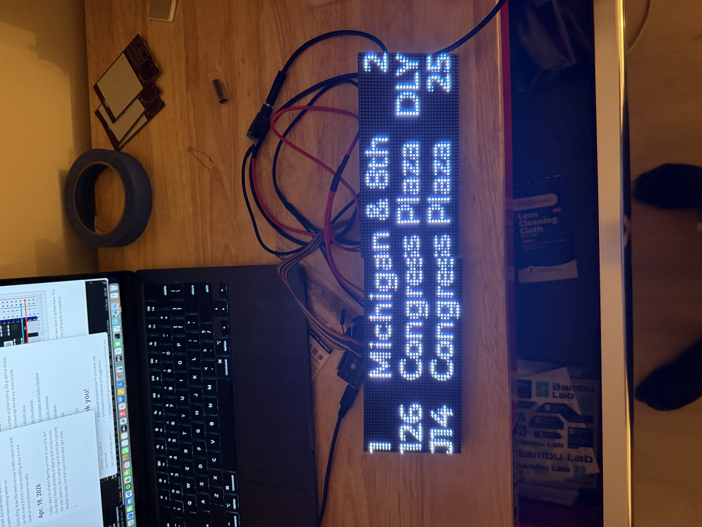
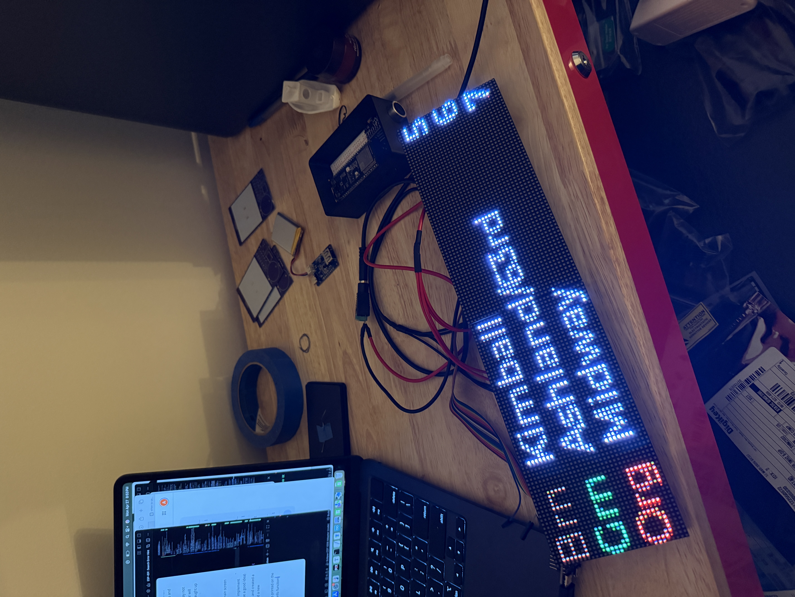
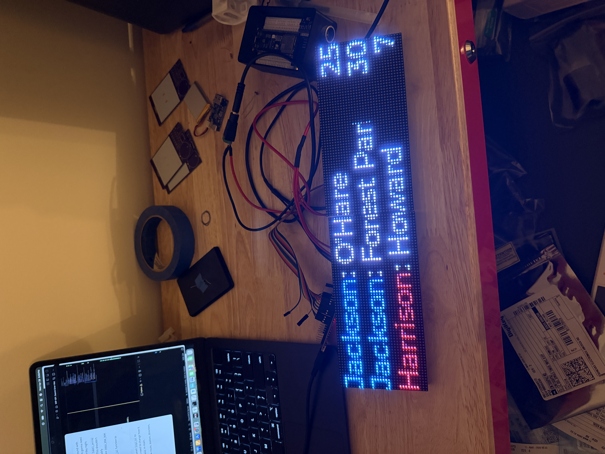

# Train Tracker journal
This is an engineering journal for me to document my progress. I don't know how much I will actually use this thing, but hopefully I stick to it.
## Mar 22, 2026
Today I started actually working on this project because I want to seriously commit to it. I have been thinking of making a transit tracker screen for a while because I think it would look cool and it sounds fun.

As of now, I have just gotten my API keys from the CTA website and I started this repo. I added some things to do in todo.md (although I should add some stuff about researching hardware to buy on there), and that's kind of all I have done for this today.

This is my overall game plan:
- Read API docs to get a rough idea of how the API works
- Make a prototype program that just prints bus/train info to the command line from an ESP32
- ^ while I build this, order some hardware (preferably one of those large LED matrix screens, as that's kind of like what the CTA uses)
- Once I get the prototype built okay, try connecting it to the LED matrix screen to display output on there
- Once I am happy with the output on the LED matrix screen, design a PCB for the circuit
- test PCB
- once I am satisfied with PCB, make an enclosure for whole thing

Excited!

## Mar 23, 2026
Okay, today I began looking at LED matrix options. This one looks good:
[Adafruit](https://www.adafruit.com/product/5036)
[AliExpress](https://www.aliexpress.us/item/2255799816372142.html?aff_fcid=e5227b8c1e8842269d58a8cb797e9c98-1774266289656-03046-_c2JPsqBp&tt=CPS_NORMAL&aff_fsk=_c2JPsqBp&aff_platform=portals-tool&sk=_c2JPsqBp&aff_trace_key=e5227b8c1e8842269d58a8cb797e9c98-1774266289656-03046-_c2JPsqBp&terminal_id=8931f672053841ee8a5de036aeb01fa5&afSmartRedirect=y&gatewayAdapt=glo2usa)
[Waveshare](https://www.waveshare.com/rgb-matrix-p2.5-64x32.htm?sku=23707)
It has its own library that I can use to control the matrix, and you can link multiple together. The linking together seems useful, so I *may* want to do it, but I think I could maybe get away with just using one of them. I guess the design trade off would be that I can show more information with two matrices linked together (i.e., stop names), but since I know exactly what stops are near my house for what routes, I don't know if I *need* to link two of these.

To connect the matrix to a board, I need a 16-pin IDC connector, like this one:
[DigiKey](https://www.digikey.com/en/products/detail/molex/0702461601/760169?gclsrc=aw.ds&gad_source=1&gad_campaignid=20560900243&gbraid=0AAAAADrbLliJBfFHop-t9JOzA3-XaYj9B&gclid=CjwKCAjwyYPOBhBxEiwAgpT8Py8OolFclUmhsOUIjvch43n7zdOdmsElHDj1cdLqBWji2bsKEcZodxoCDzMQAvD_BwE)

To power the board, Adafruit suggests using using their [wall adapter](https://www.adafruit.com/product/1466) and [2.1mm jack](https://www.adafruit.com/product/368).

This [other transit tracker project](https://transit-tracker.eastsideurbanism.org/docs/build-guide/materials#note-about-displays) uses just a [USB power supply](https://www.adafruit.com/product/1994) and a [USB-C cable](https://www.adafruit.com/product/5031).

So all together I think that's all the hardware that I need  to connect the matrix to an ESP32.

---

Ok that was this morning, tonight I set up the file structure for esp idf and I will read some of the api docs before I go to bed. 

## Mar. 24. 2026

Today I:

- went through and annotated the bus time API, gonna read the other one later (maybe omw to work)
- Went through the train time API (I did do it omw to work and also before bed lol)

As far as the bus time API goes, it looks like the main thing to worry about is just "predictions" and probably delays/cancellations (which are part of the dynamic action types). I highilighted the relevant fields of the output that I need to worry about in my local copy of the document. I'll need cJSON.

for the traintime API, it looks like the "Arrivals API" from page 5 will be the most useful. Appendix D also has useful information on how to turn this output into "minutes until this train arrives".

## Mar. 26, 2026

Yesteday and today I started coding up some basic programs, just getting the ESP32 connected to Wi-Fi and sending https requests and messing around with different things along the way. 

At first I was messing around with FreeRTOS tasks and semaphores, then I was using task notifications. Turns out I don't think I'll really need any of that, but it's in the code at the moment because that's just what I was trying out.

Right now, the ESP32 can get predictions of routes. From here, I need to parse the JSON responses so that the output is actually usable. I also will need to get multiple routes at once (which I'm pretty sure I can just do with the API).

## Mar. 30, 2026

I am travelling right now but I have continued working on this whenever possible. Here are a few design things I have been thinking about:

### Design thoughts

**General flow of the program**

- 30 second cycles
- 24 seconds
  - Output routes 
  - This seems kind of long, but depending on the number of routes you are retrieving you may have to scroll to get through all of them
    - Could be three screens of routes, each shown for 8 seconds for example
- 3 seconds
  - Output current time
    - Can just get this from CTA API or with SNTP
  - Could probably be taken out, but I just think it would be useful
- 3 seconds
  - Output other info
  - Maybe just "CTA tracker" or if there are different modes, maybe just the name of the mode

### Considerations/Edge cases

- Outdated predictions
  - Sometimes prediction timestamps are outdated (i.e., don't match the current time in the CTA system)
  - May want to check that the predictions have a timestamp within a threshold amount of time from the current time
- May want to consider dynamically allocating memory in perform_get_request()
  - if so, make it caller-owned
- What priority should the parsing task have?

## Mar. 31, 2026

Worked on this a little bit today. I updated the parse task to handle http responses from different sources, and right now it handles data from the bus prediction task and the get time task, printing the received data to the console with printf.

In the future, I want to mainly do two things:

1. Add the train data
2. Add some filtering of what to show on the display (for example, if a response's timestamp is too old, it should not show)

Once this is all handled, the minimum API side of the project is pretty close to being done I think. For a basic proof of concept, all I need to do now would be connecting all this stuff to an external display and printing

## Apr. 1, 2026

Okay, so I have been thinking a bit more about what I need hardware-wise, as I realized my earlier parts list is not great. Adafruit offers [this breakout board](https://learn.adafruit.com/adafruit-matrixportal-s3/pinouts) for ESP32 matrix control.  The breakout board itself is out of stock, but I can take the components and make my own thing. Here's what I need (based on what they have on this board):

| **Part**                     | **Quantity** | Unit **Price** | **Total Price** | **MPN**               | **Link**                                                     |
| ---------------------------- | ------------ | -------------- | --------------- | --------------------- | ------------------------------------------------------------ |
| LED Matrix                   | 2            | 17.99          |                 | RGB-Matrix-P2.5-64x32 | [Waveshare](https://www.waveshare.com/rgb-matrix-p2.5-64x32.htm?sku=23707) |
| HUB-75 Socket (maybe a 2x10) | 1            | 1.09           |                 | S6106-ND              | [DigiKey](https://www.digikey.com/en/products/detail/sullins-connector-solutions/PPPC102LFBN-RC/807245) |
| Level shifter                | 2            | 0.95           |                 | ahct245               | [DigiKey](https://www.digikey.com/en/products/detail/texas-instruments/SN74AHCT245N/277122?s=N4IgjCBcoGwJxVAYygMwIYBsDOBTANCAPZQDaIALGGABxwDsIAuoQA4AuUIAyuwE4BLAHYBzEAF9xhAExkQ6ABZJ20igFZmhGIhACAJlwC0YAAyy2nSCBCF2AT1a4ue7CklA) |
| USB-C Power Supply           | 1            | 7.95           |                 | 1994                  | [Adafruit](https://www.adafruit.com/product/1994)            |
| USB-C cable                  | 1            | 5.25           |                 | 5031                  | [DigiKey](https://www.digikey.com/en/products/detail/qualtek/3021107-01M/13181649?gclsrc=aw.ds&gad_source=1&gad_campaignid=20232005509&gbraid=0AAAAADrbLljWyom9jD6fqw8Tg_-qsQaIl&gclid=Cj0KCQjws83OBhD4ARIsACblj18_hTfEJbudFK00JUDDqoENaiXXbeZN6epAEKazdsYqEp8OduHiS_EaAhE2EALw_wcB) |
| 2x8 IDC Cable                | 1            | 1.95           |                 | 4170                  | [Adafruit](https://www.adafruit.com/product/4170?srsltid=AfmBOorfjdOh5D1p04Qbc45afL_Oq-bk-VF9IhERsBwBOS83qW3fk6iHNpM) |
| HUB-75 Plug                  | 1            | 0.32           |                 | S9171-ND              | [DigiKey](https://www.digikey.com/en/products/detail/sullins-connector-solutions/SBH11-PBPC-D08-ST-BK/1990064?_gl=1*j1ohis*_up*MQ..*_gs*MQ..&gclid=Cj0KCQjws83OBhD4ARIsACblj1-lxpeixAYIAsuX1di81NiLDhc_4hT3QPhrwWIrpjFBDfc82UlnVEAaAoDSEALw_wcB&gclsrc=aw.ds&gbraid=0AAAAADrbLlg19u8zw4DT2EaTiBKWrGHyu) |

Some thoughts:

- Power
  - On the breakout board, they power the matrix with the USB-C port
    - The USB-C port connects to two M3-threaded screw terminals
  - ESP32 seems to be powered with either JST connector or USB-C 
- HUB-75 connector
  - On the breakout board i put up there, they use a 2x10 instead of a 2x8. not totally sure why, but maybe it's helpful
  - Also, you could either have a socket here (i.e., a female connector) or a plug
    - If you have the plug, then you need to buy an IDC cable to connect to the matrix
- Multiplexer type thing
  - AHCT245
  - These were included in the adafruit breakout board I found
  - What are they?
    - **8-bit Octal Bus Transceiver**
  - Why do they use it?
    - Level shifting
    - Basically, the ESP32 is going to output at 3.3V, but the matrix needs input at 5V. This specific device helps bridge that gap
  - UPDATE, it actually works ok even if you don't use these. More details on apr. 16

## apr. 6, 2026

Today I filled in the table above and bought everything. Exciting!

^ that was in the morning.

I added some (very basic) train API functionality. It's basically just performing a get request and outputting the response. Some next steps would be to format the reponse a little more (i.e., in countdown format like the buses). I also need to add my own logic for delays/DUE notifications because the train API doesn't do this automatically like the bus one.

I was also thinking... It may be better to delay the different tasks relative to each other rather than having the big offset at the beginning I currently have. Think about this more.

Regardless, I think my task scheduling may be a little messed up. The train task doesn't seem to be executing as often as I intended. Look into this also.

## Apr. 7, 2026

I woke up a little bit ago and started working on this. I fixed the task scheduling issue I noted above (the train task said`vTaskDelay(10000)` instead of `vTaskDelay(pdMS_TO_TICKS(10000))`).

I began formatting the train API responses a little bit by making the `print_train_info` helper function. Right now, the function outputs if a train is due or if there is a delay. I still need to figure out how to format the string predictions into a countdown. 

Here are some solutions:

- could I change the strings into unix time and compare them that way? this seems like easiest option
  - can use strptime to convert the string to a tm struct, then use mktime to convert the tm struct to unix time
- I could compare each part of the string to see what is different, but this seems overly complicated

Here are some edge cases to think about:

- what happens if current time is before midnight and next train comes after midnight
- what happens if time difference is negative (I think this shouldn't happen, but I didn't read any guarantees of that in the API guide)

## Apr. 8, 2026

I was going to work on the stuff above, but I realized that I could simplify what I already have a little bit.

I realized that right now I have three tasks that basically do the same thing because I was just coding and trying stuff as I went along. Instead of doing that, I think it may be simpler and more useful to have a generic get request task (`vPerformGetRequestTask`) and a separate request scheduler task (`vRequestSchedulerTask`. 

`vRequestSchedulerTask` could send `RequestType_t`  variables to the `vPerformGetRequestTask` using a queue. Based on the request type, `vRequestSchedulerTask` can use different URLs to make the correct GET request.

One more thought: how do you get the URL?

- Could be handled by the `vPerformGetRequestTask`
  - Would mean having some sort of if statement to decide the type of request received
  - feels more messy
- Could be handled by `vRequestSchedulerTask`
  - Would pass the URL on the queue, can be done with existing QueueData_t struct

I think I'll go with second option

## Apr. 9, 2026

Okay today I'm actually gonna work on the train formatting. Here is the output of the API:
2026-04-09T07:32:07

I need to turn this into unix time first and then compare the two values. Here's how to use [strptime()](https://pubs.opengroup.org/onlinepubs/007904875/functions/strptime.html).

%Y-%m-%dT%T

I did it! 

## Apr. 14, 2026

All the parts finally arrived today, starting to assemble...

I may have run into some issues with powering the matrix, but we will see

## Apr. 15, 2026

Today I used the matrix for the first time! Everything seems to work okay. There's a few pixels near the bottom right on one of the matrices that flicker a little bit, but I may need to do some more extensive testing to figure out what is going on with that. 

Here's a picture:

For next steps, I should get more familiar with the library and read about how it works:
https://github.com/mrcodetastic/ESP32-HUB75-MatrixPanel-DMA

## Apr. 16, 2026

I'm starting to read some more about the library/matrices.

I realized that the matrix worked well even without the AHCT245s for level shifting. Based on what I have read, this isn't really supposed to happen, but the ESP32 GPIO alone (which outputs at 3.3v, not the 5v expected by the matrix) could power all the red lights on the matrix without connecting the matrix itself to power. I will try using the AHCT245 to see if I notice a difference. 

As far as the flickering issue I noted yesterday, it seems that the creator of the library I used to test recommends [connecting a capacitor on the panel's VCC and GND](https://github.com/mrcodetastic/ESP32-HUB75-MatrixPanel-DMA/issues/39#issuecomment-720780463) 

Additionally, right now my ESP32 and the panel were connected to different grounds (the ESP32 connected to my computer, but the panel connected to wall power). That could also be the culprit of the flicker.

## Apr. 17, 2026

I found a different library that works with ESP-IDF. Here it is: https://github.com/esphome-libs/esp-hub75

I decided to swtich because the other one just used arduino elements under the hood even within ESP IDF, and that just seemed a little inefficient. I began using some of the example documentation and it seems to work. I'll need to do some more testing tomorrow.

Quick thing: draw.fill() seems to map to RBG instead of RGB on this matrix (I think I read something about it in the Adafruit documentation actually)

## Apr. 18, 2026

Today I did a lot of work figuring out how to use LVGL and the library I found yesterday to display stuff on the screen the way I want to. Here's what I have (it looks like it actually displays bus data, but that's just hard coded right now):

The middle two rows scroll if they are too long, and I have set it up to update the text. Now I just need to combine this with the actual bus data stuff

## Apr. 19, 2026

Today I got the matrix to print real bus data! Right now it's kind of in a prototype state, as it only prints 3 buses out and nothing else. From here, I need to make it print more bus data and probably clean up the code a little bit.

## Apr. 20, 2026

Re: more bus data and cleaning up the code

I think it may be useful at this point to set up a Kconfig file for settings related to the bus URL (max num buses wanted, routes, etc). Later on, I want to make this info controllable with a website, but I think it will be good for now to set up the Kconfig file

How do I add support for more output?

- Right now, it just outputs 3 bus routes, but I want to output more bus routes and also potentially output train routes/the current time
- I have come up with two ides for how I could implement this with LVGL:
  - Scroll method - everything is one LVGL screen, and whenever I want something to show, I just scroll to it
    - Pros
      - Less screens to deal with
      - Could mix train and bus info if that is desired
      - Could show less blank lines potentially (I can just scroll in such a way that there are no blank lines)
    - Cons
      - Unsure how I would implement the time display
      - The look is less deterministic (will depend on how many items are on screen)
  - Active screen method - There are mutliple screens for buses and multiple screens for trains, and I just switch between them to output different content
    - Pros
      - More uniform look
      - Can just implement the time display as a separate screen
      - Seems like how you're probably meant to use LVGL tbh
    - Cons
      - Feels harder to implement (if i receive less data than the max, how do I make sure no blank/outdated screens display?)
      - How do I figure out how many screens to display?

I'll try the second method. Here's what I think I need to do:

1. Set up a screen array of size `ceil(CONFIG_TRACKER_BUS_TOP/3) + ceil(CONFIG_TRACKER_TRAIN_MAX/3)`
   1. This is the max number of screens I would need
   2. Can add an extra screen if I want to display the time
   3. I may want to set a maximum number of total screens (which would mean a max number of top/max). This could be determined by memory constraints
2. For each screen, I'm going to want labels
   1. One for each position on the screen (9 for trains/buses, just 1 for the time)
   2. I could do this in a struct, so the screen array would be an array of structs, inside the struct would be the `lv_obj_t` for the screen and and the `lv_obj_t` array for the labels 
3. in the main task
   1. I send messages to the bus, train, and time queues to send GET requests
   2. The Parse task should populate the labels/screen/struct or whatever and tell the main task how many predictions it parsed
      1. This is probably best done with a queue
      2. It should also zero out any extra space in screens
   3. Once the main task knows how many predictions were parsed, the main task can switch between the appropriate amount of screens
      1. the number of screens is just equal to `ceil(parsed_tasks/3)`
      2. how often should it switch?
         1. This could be set by the user in Kconfig or
         2. it could be decided based on 30 second intervals: we have 24 seconds for bus/train times (12 for bus, 12 for trains). If there are 4 train screens to switch through, then each gets 3 seconds, etc
4. I would need to initialize all this also
   1. I think I can do this in the lv_ui function

## Apr. 23 2026

Today I made some good progress on this. I basically got up to step 3 above. For tomorrow:

figure out a good way to let hte main task know how many predictions were parsed and to then sync. I was trying to use task notifications, but I think I may just have to use an event group and a global variable

## Apr. 24, 2026

Lots of progress today. It now prints out several screens of bus predictions. To implement it, I ended up using an event group and a global variable like I said above. 

From here, some to-dos:

- clear old predictions from active screens
  - For example, if I get one API response with 6 predictions, that fills up two screens completely. Later on, if I get an API response with just 5 predictions, that SHOULD have screen 1 with 3 predictions and screen 2 with 2 predictions, but currently, I don't clear old predictions, so screen 2 shows the 2 new predictions but it will still display the old prediction at the bottom
  - using the num_predictions variable, I can determine which rows need to be cleared on the display
    - max_predictions - num_predictions = rows_to_clear
    - where max_predictions = num_screens * ROWS_PER_SCREEN
    - and rows_to_clear tells me how many rows to clear on the last screen (should just be 1 or 2 rows)
    - this could be done in the main task or the parsing task. right now leaning to doing it in main task to limit parsing task's job to just parsing, not displaying
- eventgroup solution is currently a little janky
  - sometimes the time out doesn't leave enough time for the parse task to complete and set the event group bits
  - I could just set a longer time out
  - but the truth is that the main task is calling eventgroupwait() right when the GET request task runs, so there needs to be enough time for both the request task and the parse task to run or the main task should wait until BOTH the request task and the parse task finish (which could just be implemented using the current event group lol)
- need to update function comments because some things have changed

## Apr. 26, 2026

I fixed most of the things above (I have not updated the function comments because I'm still messing with those)

Now I need to think of how to integrate trains predictions into the system

The overall flow is simple:

1. Get bus and train predictions
2. Print the predictions

I need to consider a few things:

- do I get all the predictions at the same time and then print them? OR do I get and print bus predictions and then later get and print train predictions
  - The former may be more consistent, but may not always show the latest data, while the latter will always show the latest data but may get caught up with the GET requests
- Do they all share one screen array?
  - i think lowkey no
  - it will be easier to manage if there is a train screen array and a separate bus screen array
  - also avoids race conditions if i want to implement concurrency later (which I think may be a good idea)

Ok it's not the end of the day. I went through and created a new screen array for train screens and added a new funciton for screen creation. 

Tomorrow I should try to actually get things printed on the screen (start by modifying the print_train_info funciton)

## Apr. 27, 2026

I did it! It now displays information for both trains and buses

Now I should clean up the code and add more robust error handling. I'm also considering how I display trains. Right now, it obviously doesn't show what train stop the prediction is for. While clearly this is important info, I think it would make the display overly crowded (and realistically, I will know what station the predictions are for lol)

Now that I am thinking about it, I don't really show direction info for buses either...

I think to show this info, I could do the following

- trains
  - [Red] [Harrison to Howard] [Min]
  - [Color] [Station to Destination] [Min]
- Buses
  - [Route] [Direction - Stop] [Min]
  - [1] [N - Michigan & 8th Street] [Min]

Okay I did this. The buses work pretty well, but honeslty the trains are hard to read. I think I'm gonna keep the direction for the buses but not the trains for now. A potential solution for trains is showing the display like this:

[Station to Destination] [Min], where [Station to Destination] is in the color of the station

This would require a new label set up for trains, though (which I think is fine)

I'm gonna start experimenting with this later. for now, I'll keep trains directionless and buses with direction.

## Apr. 28, 2026

It's the morning right now. I started messing around with the new train layout a little bit, but I realized I'm gonna need a slightly bigger overhaul than I thought yesterday night. 

Basically, I would need to have different size `label_array` variables for the bus and the train screens. This shouldn't actually be too bad; I would just have to modify `create_screens` and probably add separate `COLS_PER_ROW` macros for buses and trains.

Additionally, I'll need to modify the `lvgl_ui` function to make train and bus UIs. 

## Apr. 29, 2026

Started work on ^ today. So far, I updated `lvgl_ui` to handle both bus and train UIs. Now I need to change how it is actually used inside `create_screens` in main.

I did it! The train displays now show route, station, direction, and prediction!!!

tomorrow i should start cleaning up the code 

## Apr. 30, 2026

I started cleaning up the code as promised. I added several helper functions, and now app_main() is much easier to follow. It also handles failed GET requests a lot more gracefully now and handles some issue with train prints better.
